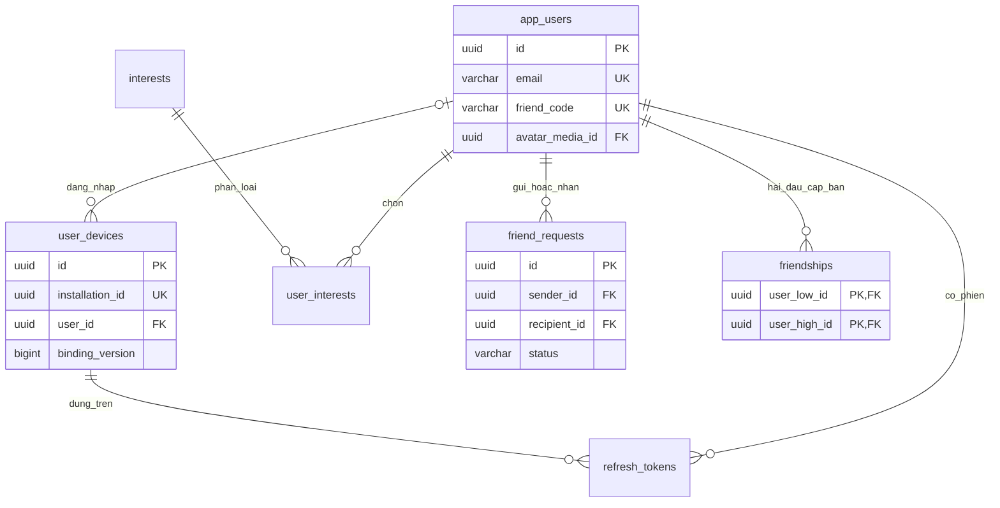
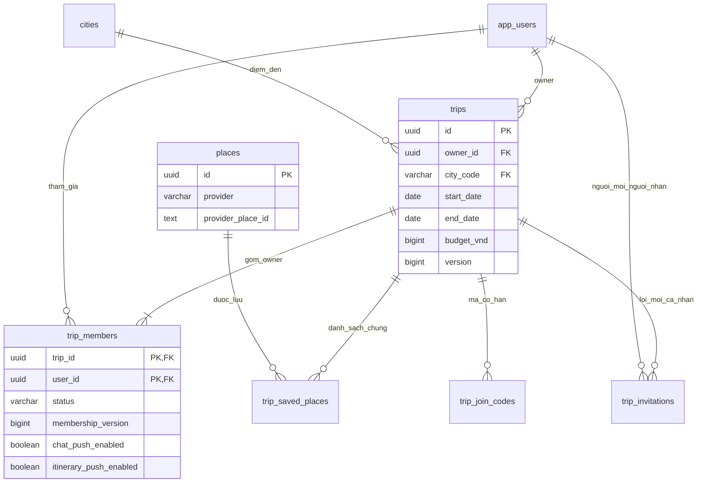
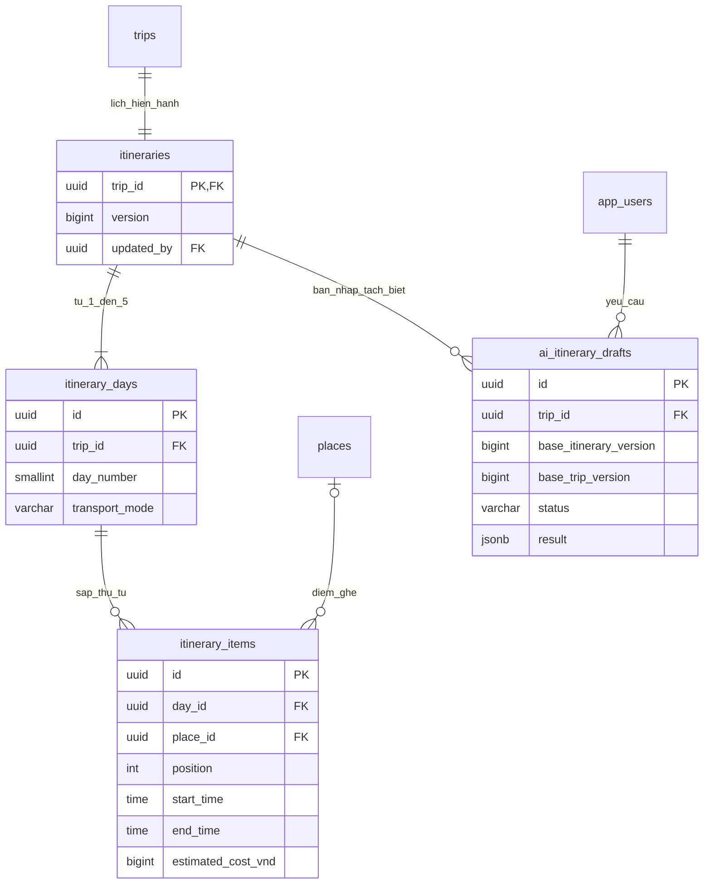
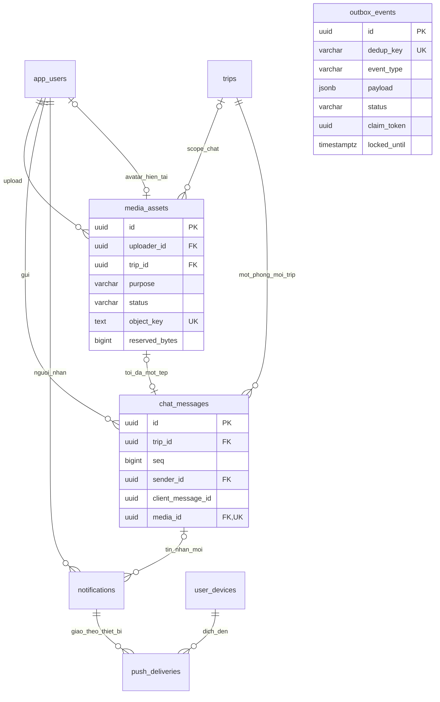

# TripMate — Database ERD v1

Ngày thiết kế: **13/09/2026**. Trạng thái: **bản thiết kế để triển khai và review**.

Thiết kế gồm **23 bảng PostgreSQL**, dùng chung cho các backend. Redis giữ vị trí ngắn hạn và truyền sự kiện; Cloudflare R2 giữ tệp. Máy cá nhân làm nút thứ 3 không tạo thêm database nghiệp vụ độc lập.

## 1. Căn cứ và những giả định của v1

Đã đọc [TRIPMATE_PLAN.md](TRIPMATE_PLAN.md) và các tin nhắn liên quan trong phiên **“Lập kế hoạch app TripMate”** ngày 13/09/2026, cùng phiên khởi đầu trước đó. Kế hoạch hiện tại là căn cứ chính, bao gồm thay đổi Java 26 của người dùng.

[UI sơ bộ trên Stitch](https://stitch.withgoogle.com/projects/3626733689084965569) **chưa xem được**: truy cập web không thành công và công cụ trình duyệt lỗi khởi động cả hai lần thử. Các liên kết màn hình bên dưới được suy ra từ phần “Giao diện” trong kế hoạch, chưa phải kết quả kiểm tra thiết kế Stitch.

Phạm vi đã chốt:

- Một chuyến, một thành phố Việt Nam, 1–5 ngày, tối đa 10 thành viên **tính cả owner**.
- Mọi thành viên đang hoạt động sửa được lịch; owner sửa/xóa chuyến, mời và loại thành viên.
- Kết bạn qua QR/mã; chat theo chuyến với văn bản hoặc một ảnh/PDF tối đa 10 MB.
- AI tạo bản nháp, xem trước rồi áp dụng; lịch thủ công luôn dùng được.
- Inbox thông báo, FCM, mute chat/lịch trình theo chuyến; vị trí chỉ khi chủ động bật và app mở.

Các lựa chọn bổ sung của bản thiết kế, có thể điều chỉnh khi xem được UI:

| Điểm chưa được kế hoạch mô tả hết | Lựa chọn v1 |
| --- | --- |
| Thông tin đăng nhập | Email + mật khẩu; chuẩn hóa email trước khi lưu. Không thêm OTP/số điện thoại |
| “Lưu địa điểm” | Danh sách chung **theo chuyến đi**; chưa có bookmark cá nhân độc lập |
| Ngân sách | Ngân sách dự kiến toàn nhóm, không phải mỗi người; NULL là chưa đặt, 0 là đã nhập 0 |
| Chi phí mục lịch | Chỉ ghi số do người dùng nhập; thiếu nguồn thì NULL. Không tự gán giá AI thành dữ liệu đã xác minh |
| Owner rời chuyến | V1 owner xóa chuyến; chưa có chuyển quyền. Owner luôn là thành viên ACTIVE |
| Thành viên tham gia sau | Xem được toàn bộ lịch sử chat của chuyến khi đang ACTIVE |
| Người bị loại | Không tự quay lại bằng mã cũ; owner phải gửi lời mời mới |
| Quy mô tệp | 10 MB = 10.000.000 byte; trần dự án 2 GB = 2.000.000.000 byte; avatar dùng cùng trần upload, sau đó chuẩn hóa nhỏ hơn |
| Ngày lịch | Mỗi ngày có giờ bắt đầu/kết thúc trong cùng ngày; mục qua đêm tách thành hai mục |
| Danh mục thành phố | Mã nội bộ ứng dụng; kiểm thử đầu tiên HANOI, DANANG, HCMC; không coi đây là mã hành chính |

Không đưa booking, thanh toán, chia tiền, chat riêng, OTP, chuyến nhiều thành phố hoặc lịch sử GPS vào ERD này.

## 2. Tệp thiết kế và cách đọc

- [tripmate_v1.dbml](docs/database/tripmate_v1.dbml): đầy đủ bảng, cột, PK/FK, cardinality và unique cơ bản; có thể import vào dbdiagram.
- [tripmate_v1.sql](docs/database/tripmate_v1.sql): DDL tham chiếu PostgreSQL, bao gồm CHECK, partial index và deferred constraint.
- [DATA_DICTIONARY.md](docs/database/DATA_DICTIONARY.md): giải thích từng thuộc tính, toàn bộ quan hệ FK và cách dùng từng index cho thành viên mới.
- [TECHNOLOGY_DECISIONS.md](docs/TECHNOLOGY_DECISIONS.md): lý do lựa chọn công nghệ và đánh đổi.
- Tài liệu này: sơ đồ theo nhóm, ý nghĩa dữ liệu, transaction và các quy tắc backend phải thực hiện.

**SQL là nguồn chi tiết cho ràng buộc vật lý.** DBML không mô tả đầy đủ partial index, giá trị mặc định và kiểm tra trạng thái. SQL hiện là tài liệu tham chiếu, chưa được đặt vào Flyway và chưa thay đổi backend.

Quy ước:

- Bảng/cột dùng snake_case. ID UUID do backend sinh; PK ghép cho quan hệ nhiều-nhiều.
- `timestamptz` cho thời điểm; server/session DB đặt UTC. `date`/`time` cho ngày giờ chuyến tại `Asia/Ho_Chi_Minh`.
- VND dùng `bigint`, không dùng float. API trả bigint có thể vượt độ chính xác JavaScript dưới dạng chuỗi.
- `created_at` có DEFAULT; backend phải cập nhật `updated_at` khi sửa, SQL chưa có trigger tự cập nhật.
- Trạng thái dùng varchar + CHECK để dễ đọc và mở rộng bằng migration.
- Trạng thái “sắp đi/đang đi/đã qua” suy ra từ ngày tại múi giờ chuyến; không cần cột status bị lệch ngày.
- JSONB chỉ dành cho bản nháp AI và payload outbox có schema; không nhét thành viên/lịch hiện hành vào JSON.

## 3. Sơ đồ quan hệ

Ký hiệu: `||` là đúng một, `o|` là không hoặc một, `o{` là không hoặc nhiều, `|{` là ít nhất một. Các sơ đồ thể hiện quan hệ nghiệp vụ chính; DBML/SQL chứa đầy đủ 55 khóa ngoại. “Một lịch mỗi chuyến” và “ít nhất owner” phải được tạo cùng transaction.

### 3.1. Tài khoản và bạn bè



Một thiết bị có thể chưa gắn tài khoản sau logout; `user_devices.user_id` được phép NULL, tương ứng phía tài khoản là không hoặc một.

### 3.2. Chuyến đi, thành viên và địa điểm



### 3.3. Lịch trình và bản nháp AI



### 3.4. Media, chat và thông báo



`outbox_events.aggregate_id` là định danh đối tượng theo loại sự kiện, **không phải FK đa hình được DB bảo vệ**. Backend kiểm tra payload; event được ghi cùng transaction nghiệp vụ. Tham chiếu từ notification đến lời mời/tin nhắn được dùng FK cụ thể.

## 4. Danh mục bảng

| Nhóm | Bảng | Vai trò và dữ liệu đáng chú ý |
| --- | --- | --- |
| Tài khoản | app_users | Email, password_hash, display_name, friend_code, avatar_media_id; không lưu mật khẩu gốc |
| Tài khoản | user_devices | installation_id duy nhất, tài khoản hiện tại, FCM token, quyền push, binding_version |
| Tài khoản | refresh_tokens | Chỉ token_hash; family_id, parent_token_id, expires_at, consumed_at, revoked_at |
| Sở thích | interests | Danh mục code/label, ví dụ FOOD, NATURE, CULTURE |
| Sở thích | user_interests | PK (user_id, interest_code), không dùng chuỗi phân cách bằng dấu phẩy |
| Bạn bè | friend_requests | Lời mời có hướng và trạng thái; giữ lịch sử yêu cầu đã xử lý |
| Bạn bè | friendships | PK (user_low_id, user_high_id); chỉ các quan hệ bạn bè đang tồn tại |
| Chuyến đi | cities | Danh mục điểm đến nội bộ, VN và múi giờ cố định |
| Chuyến đi | trips | Owner, thành phố, ngày đi/về, ngân sách; version thông tin chuyến, last_chat_seq |
| Chuyến đi | trip_members | PK (trip_id, user_id); ACTIVE/LEFT/REMOVED, membership_version, mute settings |
| Chuyến đi | trip_invitations | Owner mời một bạn cụ thể; thời hạn, trạng thái và resolved_at |
| Chuyến đi | trip_join_codes | code_digest, thời hạn, thu hồi; mỗi trip tối đa một mã chưa thu hồi |
| Địa điểm | places | UUID nội bộ + Google place ID duy nhất theo provider |
| Địa điểm | trip_saved_places | PK (trip_id, place_id), added_by, ghi chú người dùng; shortlist chung |
| Lịch trình | itineraries | PK đồng thời FK trip_id; version chung cho mọi ngày/mục |
| Lịch trình | itinerary_days | UUID, trip_id, day_number, WALK/DRIVE, ghi chú |
| Lịch trình | itinerary_items | PLACE/NOTE, vị trí, giờ, ghi chú, chi phí người dùng, MANUAL/AI |
| AI | ai_itinerary_drafts | Hai base version, candidate IDs, preferences/result JSON, trạng thái và kết quả apply |
| Tệp | media_assets | Metadata R2, purpose/scope, trạng thái, quota reservation, tombstone và purged_at |
| Chat | chat_messages | TEXT/IMAGE/PDF, caption/body, một media_id, client_message_id, request_hash, seq |
| Thông báo | notifications | Inbox người nhận; loại, FK điều hướng, nội dung chung, read_at và event_key |
| Sự kiện | outbox_events | Công việc hậu commit: Redis publish, fanout push, xóa R2; lease và retry |
| Push | push_deliveries | Theo notification/thiết bị/binding, membership version lúc tạo; trạng thái gửi và retry |

Các cột, kiểu dữ liệu, tính NULL và khóa đầy đủ nằm trong DBML/SQL. Foreign key đến membership lịch sử chỉ bảo đảm từng có membership, **không chứng minh đang ACTIVE**.


## 5. Ràng buộc và transaction bắt buộc

DB bảo vệ PK/FK, tính duy nhất và CHECK trên một hàng. Giới hạn 10 thành viên, quyền ACTIVE và tính hợp lệ nhiều ngày cần transaction ở backend; không đặt một CHECK đếm hàng từ bảng khác. PostgreSQL không bảo đảm CHECK tham chiếu dữ liệu hàng khác theo cách đó. [Tài liệu PostgreSQL về constraints](https://www.postgresql.org/docs/17/ddl-constraints.html)

### 5.1. Tài khoản, thiết bị và QR

- Email trim + lowercase trước insert/login; mật khẩu dùng password encoder thích hợp, không dùng SHA-256 thuần cho mật khẩu.
- Refresh token ngẫu nhiên đủ mạnh; DB chỉ lưu SHA-256 token. Khóa hàng token khi refresh, đánh dấu consumed và tạo token con **cùng transaction**. parent_token_id UNIQUE chặn hai token con.
- Token bị dùng lại: thu hồi cả family; logout thu hồi các family của phiên trên thiết bị. Client phải gộp các yêu cầu refresh đồng thời để tránh tự tạo replay.
- Giữ token cũ đã consumed tới khi family không còn hợp lệ để phát hiện replay; family có thời hạn tối đa theo cấu hình, không gia hạn vô tận chỉ bằng token con.
- user_devices.id là hàng ổn định theo installation_id. Logout xóa fcm_token, đặt user_id NULL, tắt push và tăng binding_version. Đổi tài khoản/token tăng binding_version; thao tác phải khóa hàng thiết bị.
- installation_id là định danh, không phải bằng chứng xác thực. Mọi đăng ký lại thiết bị cần phiên đăng nhập hợp lệ; không được đổi chủ chỉ bằng một ID client gửi lên.
- friend_code là mã công khai ngẫu nhiên, đủ khó đoán, có thể hiện dưới QR hoặc nhập tay. Chỉ trả hồ sơ giới hạn gồm id, display_name, avatar; không lộ email.
- Mã QR không phải token đăng nhập hay mã tham gia chuyến.

### 5.2. Kết bạn

friend_requests có hướng gửi–nhận; friendships là cặp không hướng, lưu theo thứ tự UUID tăng dần.

- CHECK chặn tự gửi lời mời; partial unique index trên least/greatest chặn hai yêu cầu PENDING cùng cặp, kể cả ngược chiều.
- Mọi thao tác gửi/chấp nhận/hủy/hủy kết bạn khóa hai hàng app_users theo thứ tự UUID tăng dần, rồi kiểm tra quan hệ hiện tại; các đường API đều dùng cùng thứ tự khóa.
- Gửi khi đã là bạn: trả quan hệ hiện có. Gửi ngược một lời mời PENDING: trả lời mời đó để người nhận xử lý, không tự chấp nhận.
- Chấp nhận: đúng recipient, đang PENDING; cập nhật ACCEPTED + resolved_at, insert friendship, notification và outbox cùng transaction.
- Từ chối do recipient; hủy do sender. Retry thao tác đã hoàn thành trả trạng thái hiện tại.
- Hủy kết bạn xóa đúng hàng friendships; lịch sử friend_requests vẫn giữ. Không sửa trip_members.
- V1 cho phép gửi lời mời mới sau từ chối/hủy/hủy kết bạn, có rate limit ở API; không chặn vĩnh viễn cả cặp bằng UNIQUE toàn bảng.

### 5.3. Tạo chuyến, lời mời và giới hạn thành viên

Tạo trips → trip_members của owner → itineraries → đủ itinerary_days trong **một transaction**. FK owner-membership được kiểm tra lúc COMMIT để giải quyết vòng tham chiếu.

trips.owner_id là nguồn duy nhất xác định owner; API tính role OWNER/MEMBER từ đó, không lưu thêm role có thể mâu thuẫn trong membership.

Tham gia bằng lời mời hoặc mã dùng cùng một service:

1. Khóa trips bằng SELECT FOR UPDATE.
2. Kiểm tra chưa deleted, mã/lời mời còn hạn, chưa thu hồi và đúng người nhận nếu là lời mời.
3. Nếu đã ACTIVE, trả membership hiện có; không tăng số thành viên.
4. Đếm ACTIVE, từ chối nếu đã 10. Lời mời chưa nhận không chiếm chỗ.
5. Insert membership hoặc tái kích hoạt; tăng membership_version khi tái kích hoạt/thu hồi, cập nhật joined_at/ended_at.
6. Hoàn tất invitation nếu có và commit. Hai yêu cầu tranh chỗ cuối được tuần tự hóa bằng cùng khóa trip.

Owner chỉ mời người đang là bạn tại lúc tạo lời mời. Nếu sau đó hủy kết bạn, lời mời còn hạn vẫn dùng được vì owner đã chủ động cấp lời mời; owner có thể hủy riêng. Người LEFT được tham gia lại bằng mã hợp lệ; người REMOVED cần lời mời mới từ owner sau thời điểm bị loại.

Mã tham gia khác mã QR cá nhân: code_digest = HMAC-SHA-256 của mã đã chuẩn hóa với server secret; không lưu mã rõ. API có rate limit. Mã chỉ hiện rõ lúc tạo/đổi; có thể phát hành mã mới khi cần chia sẻ lại. V1 đề xuất hết hạn sau 7 ngày. Trước khi tạo mã mới, thu hồi mã chưa revoked, kể cả đã hết hạn; index không dùng now() trong predicate. Invitation hết hạn được chuyển EXPIRED trong transaction trước khi mời lại; request vẫn kiểm tra expires_at dù job chưa chạy.

Mọi remove/leave/delete đều khóa trip trước; owner không được LEFT/REMOVED. Xóa chuyến là đặt deleted_at, thu hồi mã và invitation PENDING, hủy công việc push còn chờ khi xử lý, phát sự kiện thu hồi và dọn media theo chính sách. Không xóa cứng membership/chat để né FK.

### 5.4. Lịch trình, version và ngày đi

- Một itineraries cho mỗi trip; version tăng cho **mọi** thay đổi ngày/mục, reorder, transport_mode, ghi chú và apply AI.
- Client gửi expectedVersion; backend kiểm tra quyền, khóa trip rồi itinerary, so sánh version. Sai trả 409 kèm version mới; đúng sửa và tăng version cùng transaction.
- trip.version theo dõi thông tin chuyến (title/city/dates/budget/description), không tăng vì chat hoặc thay thành viên. Cập nhật thông tin chuyến cũng dùng expectedTripVersion.
- Đổi start/end_date phải tăng cả trip.version và itinerary.version. Ngày thực được suy ra, không lưu thêm itinerary_days.date dễ lệch.
- Số day rows bằng end_date - start_date + 1. Rút ngắn chuyến khi các ngày bị cắt còn mục: trả lỗi để người dùng chuyển/xóa mục trước; không tự làm mất lịch.
- Đổi city khi đã có saved places hoặc PLACE items: từ chối và yêu cầu người dùng xử lý lịch/địa điểm cũ trước. Không lặng lẽ giữ lịch của thành phố khác.
- UNIQUE(trip_id, day_number); UNIQUE(day_id, position) được deferred để đổi chỗ hai mục trong transaction.
- Backend kiểm tra day thuộc đúng trip, ngày trong phạm vi, time hợp lệ, không trùng khoảng giờ; position liên tục từ 0 và thứ tự khớp thời gian. Di chuyển mục sang ngày khác kiểm tra cả hai ngày.
- NOTE là ghi chú/nghỉ tự tạo, không phải điểm Google. PLACE phải có place_id. custom_title chỉ là tiêu đề do người dùng nhập, không tự sao chép displayName từ Google.
- Tính tuyến bỏ qua NOTE, dùng PLACE theo thứ tự; chỉ WALK/DRIVE. Dữ liệu tuyến thiếu thì thông báo rõ, lịch thủ công vẫn chỉnh được.

Thứ tự khóa chung cho thao tác chuyến: trip → membership liên quan → itinerary → media (nếu có, UUID tăng dần). Không giữ transaction DB khi gọi Google, Groq, R2 hoặc FCM.

### 5.5. Bản nháp AI

Luồng: GENERATING → READY hoặc FAILED; READY → APPLIED hoặc EXPIRED. Draft READY có base version cũ được hiển thị “đã lỗi thời”, không áp dụng.

- Ghi base_trip_version và base_itinerary_version lúc tạo, cùng preferences chỉ chứa dữ liệu người dùng và candidate IDs.
- Gọi provider ngoài transaction, timeout 45 giây. Không lưu API key, prompt thô hoặc response provider thô.
- result là JSON đã lọc và validate, có schema_version. V1 đề xuất draft còn hiệu lực tối đa 24 giờ; job khôi phục GENERATING quá timeout thành FAILED.
- Các ID trong JSON không có FK tự động: validator bắt buộc kiểm tra tồn tại, nằm trong candidate set, đúng thành phố và lịch/ngày/giờ hợp lệ.
- Không lưu lâu dài tên/ảnh/rating/giờ mở cửa/polyline lấy từ Google trong draft. Result dùng ID, ngày, giờ và ghi chú hợp lệ.
- Khi apply: khóa trip và itinerary, kiểm tra ACTIVE, draft READY/chưa hết hạn, so sánh **cả hai base version**, kiểm tra lại dữ liệu/đầu ra.
- Thay lịch và đánh APPLIED, applied_by, applied_at, applied_itinerary_version, tạo notification/outbox cùng transaction. Mỗi lần apply tăng itinerary.version đúng một lần.
- Retry apply draft đã APPLIED trả kết quả đã ghi; tuyệt đối không apply lần nữa, kể cả lịch hiện tại đã được sửa tiếp.
- client_request_id chống tạo lặp do retry mạng. “Tạo lại” chủ động dùng ID mới và sinh draft mới, vẫn giữ lịch hiện hành.

Ví dụ cấu trúc result, các UUID được thay bằng giá trị thật khi chạy:

```json
{
  "schema_version": 1,
  "days": [
    {
      "day_number": 1,
      "transport_mode": "WALK",
      "items": [
        {
          "place_id": "<uuid-noi-bo-trong-candidate-set>",
          "position": 0,
          "start_time": "09:00",
          "end_time": "10:30",
          "note": ""
        }
      ]
    }
  ],
  "warnings": []
}
```

### 5.6. Địa điểm và tuyến đường

places là bảng định danh dùng lại được giữa nhiều chuyến. Xóa trip_saved_places không xóa places hoặc itinerary_items đang dùng địa điểm.

Google cho phép lưu place ID lâu dài; không suy ra từ đó rằng được lưu mọi Places response lâu dài. Vì vậy schema chỉ giữ ID provider; tên, địa chỉ, ảnh, tọa độ, rating, giờ mở cửa và tuyến đường lấy qua adapter khi cần. Nếu triển khai cache, phải kiểm tra điều khoản của từng API/trường dữ liệu; TTL Redis tự nó không tạo quyền cache. [Chính sách Places API](https://developers.google.com/maps/documentation/places/web-service/policies)

Không có bảng route, route_points hay place_reviews trong v1. Kết quả tuyến phụ thuộc trip_id, itinerary.version, day_number và mode; khi lịch đổi phải lấy lại. Không lưu “giá AI” như một báo giá.

### 5.7. Media, quyền truy cập và quota

Trạng thái chính: PENDING → READY → ATTACHED → DELETED; upload lỗi → FAILED. DELETED là tombstone, có thể còn chờ xóa object R2. purged_at xác nhận object chính/thumbnail đã được dọn; chỉ khi đó giải phóng reservation.

- Mỗi upload tạo metadata với object_key do server chọn. Kiểm tra bytes thực tế, magic bytes, MIME, kích thước và chuẩn hóa ảnh trước READY. Không tin extension/MIME từ client.
- purpose=AVATAR thì trip_id NULL và phải là ảnh. purpose=CHAT thì trip_id bắt buộc và uploader từng có membership.
- Avatar: FK ghép buộc thuộc chính user; service kiểm tra purpose AVATAR, READY và định dạng, gắn rồi chuyển ATTACHED cùng transaction. Thay avatar đánh avatar cũ DELETED và enqueue xóa R2.
- Chat: FK ghép (media_id, trip_id, sender_id) buộc tệp cùng trip và do sender upload; UNIQUE(media_id) chặn tái dùng tệp cho tin thứ hai. Service kiểm tra READY, purpose CHAT và loại IMAGE/PDF đúng MIME.
- Download chat file/thumbnail: kiểm tra user ACTIVE, trip chưa xóa và asset ATTACHED trước stream. Profile avatar hiện tại chỉ trả qua các ngữ cảnh hồ sơ được phép (bạn bè, QR, cùng chuyến); không cho liệt kê asset theo uploader.
- Sender hoặc owner được xóa attachment khi còn quyền trong trip. Giữ chat_messages.media_id và media tombstone để UI hiện “Tệp đã xóa”; không biến tin thành hàng trống.
- Tệp PENDING/READY chưa gắn được dọn sau 24 giờ. Cleaner khóa hàng media rồi kiểm tra lại trạng thái và tham chiếu; cạnh tranh attach/cleanup được tuần tự hóa.
- Backend stream qua R2 riêng tư; không lưu binary, URL tải công khai cố định hoặc signed URL trong DB.
- reserved_bytes gồm object chính + thumbnail và dự trữ upper bound trước upload. Dùng một PostgreSQL advisory transaction lock cố định cho quota toàn dự án: lấy SUM(reserved_bytes), kiểm tra cộng thêm <= 2.000.000.000 rồi reserve/commit.
- Mọi tạo/tăng/giảm reservation đều đi qua cùng khóa quota. Không giữ khóa khi upload; không cho final bytes vượt reservation nếu chưa reserve phần tăng thêm.
- Job xóa R2 idempotent, xóa cả thumbnail; chỉ đặt purged_at và reserved_bytes=0 sau khi chắc chắn object không còn. Reconcile object_key định trước để dọn upload nửa chừng nếu worker chết sau khi R2 đã nhận tệp.

Không cần thêm bảng quota singleton ở quy mô v1; advisory lock + metadata reservation tránh hai backend cùng vượt trần. Không giải phóng quota chỉ bằng đổi status khi R2 chưa được dọn.

### 5.8. Chat: chống trùng và không mất tin khi reconnect

Mỗi trip là một phòng; không cần chat_rooms/conversation_members trùng với trips/trip_members.

1. Khóa trip, kiểm tra thành viên ACTIVE và trip chưa deleted.
2. Tìm (trip_id, sender_id, client_message_id). Có rồi và request_hash giống: trả tin đã lưu; khác payload: 409.
3. Với tin mới, kiểm tra body/media và quyền; tăng trips.last_chat_seq, dùng giá trị đó làm chat_messages.seq.
4. Insert message, attach media nếu có, insert notifications cho thành viên khác và outbox cùng transaction.
5. Commit trước khi publish Redis/WebSocket. Worker retry dùng event/message ID để client loại trùng.

seq tăng dưới khóa trip và commit cùng message, giúp cursor after_seq không bỏ sót một transaction commit muộn có số nhỏ hơn. Không dùng timestamp đơn lẻ hoặc sequence toàn cục để giả định thứ tự commit. Trả lịch sử ORDER BY seq; index UNIQUE(trip_id, seq) phục vụ cả lịch sử và tải bù.

Trạng thái đang upload/đang gửi/gửi lỗi/thử lại nằm ở client; DB chỉ lưu message đã được chấp nhận. Retry dùng nguyên client_message_id. Không gắn thêm SENT/FAILED vào tin đã commit để biểu diễn mạng phía client.

### 5.9. Inbox, outbox và FCM trên nhiều backend

- Mỗi sự kiện tạo notifications cho các người nhận phù hợp, trừ actor. UNIQUE(event_key, recipient_id) chống tạo inbox trùng.
- Với chat/lịch trình, người nhận là thành viên ACTIVE tại thời điểm sự kiện. Tắt chat/lịch trình chỉ tắt push, inbox vẫn giữ để người dùng xem lại.
- title/body dùng nội dung chung như “Có tin nhắn mới”, không chứa nội dung chat riêng tư, URL tệp hoặc tọa độ. App tải chi tiết sau khi kiểm tra quyền.
- FK thông báo là FK thật nhưng chưa tự kiểm tra chat_message_id/trip_invitation_id thuộc trip_id: backend kiểm tra lúc tạo; client không được tự ghi notification.
- Outbox ghi cùng transaction nghiệp vụ. Worker fanout tạo push_deliveries theo notification + device + binding_version, idempotent nhờ UNIQUE; publish WebSocket với event ID.
- Một outbox có thể retry fanout đã làm một phần; các delivery đã tồn tại không được reset SENT hoặc tăng lại số lần gửi.
- Hai backend claim hàng bằng FOR UPDATE SKIP LOCKED, ghi PROCESSING + locked_by + claim_token + locked_until rồi commit; thực hiện I/O sau commit.
- Cả outbox lẫn push_deliveries dùng lease đề xuất 60 giây, renew trước khi hết; mỗi claim tăng attempts. Worker chết: lease hết hạn cho worker khác claim. Worker cũ chỉ hoàn tất khi claim_token vẫn khớp.
- Retry đề xuất tối đa 8 lần, exponential backoff có jitter; lỗi cuối hoặc quá số lần thành DEAD. Reaper cũng phải chuyển PROCESSING hết lease ở lần cuối sang DEAD; luôn xóa bộ trường lock khi ra khỏi PROCESSING.
- Claim loại SKIP LOCKED phù hợp xử lý bảng hàng đợi; không dùng nó để đọc danh sách nghiệp vụ thông thường. [Tài liệu PostgreSQL SELECT](https://www.postgresql.org/docs/17/sql-select.html)
- Trước mỗi lần gửi, kiểm tra recipient còn khớp device.user_id/binding_version, token và quyền push còn hợp lệ. Không sao chép token vào outbox.
- Chat/lịch trình cần kiểm tra membership vẫn ACTIVE và membership_version khớp. **Lời mời chuyến đi là ngoại lệ:** người nhận chưa là thành viên; kiểm tra invitee, PENDING/chưa hết hạn và trip còn tồn tại.
- Token không hợp lệ: vô hiệu hóa binding hiện tại có điều kiện theo version; không được xóa token mới vừa đăng ký bởi một request khác.
- Một thiết bị gửi thành công không bị gửi lại chỉ vì thiết bị khác lỗi. SENT nghĩa là FCM đã nhận, không chứng minh điện thoại đã hiển thị.
- Đảm bảo thực tế là **at-least-once**: nếu FCM nhận rồi worker chết trước khi cập nhật SENT, có thể gửi lặp. notification ID dùng để khử trùng trong app; không tuyên bố exactly-once.
- Mute, logout, bị loại hoặc trip xóa sau khi enqueue: delivery còn chờ được SKIPPED khi kiểm tra lại. Push đã nằm ở provider không thu hồi chắc chắn; payload chung tránh mang nội dung riêng tư, app luôn xác thực lại.
- Khi đang mở đúng phòng chat, mobile xử lý foreground notification không hiện banner; không cần lưu trạng thái “đang xem phòng” lâu dài trong PostgreSQL.

### 5.10. Vị trí trực tiếp và thu hồi quyền

Không có bảng location_history. Redis giữ key `trip:{tripId}:location:{userId}` với lat/lng, accuracy_m, server_received_at và membership_version; cập nhật khoảng 10 giây, TTL 60 giây.

Bật/tắt chia sẻ là lựa chọn của người dùng trong phiên đang mở, không dùng boolean PostgreSQL để suy diễn người đó đang online. App xuống nền/tắt chia sẻ gửi yêu cầu xóa key nếu có thể; nếu mất mạng thì TTL xử lý.

REST, STOMP SEND/SUBSCRIBE và outbound fanout đều kiểm tra membership ACTIVE. Sự kiện thu hồi qua outbox/Redis giúp đóng subscription trên mọi instance, nhưng không được dựa riêng vào Pub/Sub để bảo vệ quyền. Kiểm tra quyền hiện tại trước khi giao dữ liệu; key/sự kiện mang membership_version cũ bị bỏ qua, kể cả có cập nhật Redis đến muộn sau lúc bị loại.

Rời nhóm hoặc xóa trip xóa location key theo best effort; TTL là lớp dọn bổ sung. Không gửi tọa độ qua FCM, không log tọa độ. Tệp đã được tải về thiết bị trước khi bị loại không thể bị “thu hồi” bằng FK; sau thu hồi chỉ bảo đảm chặn các yêu cầu mới tới server.

## 6. Mapping màn hình → dữ liệu

Mapping này lấy từ kế hoạch, cần đối chiếu lại khi truy cập được Stitch.

| Màn hình/luồng | Bảng hoặc nguồn |
| --- | --- |
| Đăng ký, đăng nhập | app_users, refresh_tokens, user_devices |
| Hồ sơ, avatar, sở thích, QR | app_users, media_assets, interests, user_interests |
| Bạn bè, lời mời | friendships, friend_requests |
| Danh sách chuyến đi | trip_members ACTIVE + trips chưa deleted + cities |
| Tạo/sửa chuyến | trips, cities; tạo đồng thời owner membership và itinerary/days |
| Thành viên, mời bạn, nhập mã | trip_members, trip_invitations, trip_join_codes, friendships |
| Lưu địa điểm, danh sách marker | trip_saved_places, places; chi tiết Google lấy qua adapter |
| Lịch theo ngày | itineraries, itinerary_days, itinerary_items |
| Sinh/xem trước/áp dụng AI | ai_itinerary_drafts; chỉ apply mới ghi lịch hiện hành |
| Bản đồ, tuyến đường | itinerary_items + Google Maps/Routes; vị trí nhóm từ Redis |
| Chat chữ/ảnh/PDF | chat_messages, media_assets; lịch sử tải bù theo seq |
| Danh sách thông báo | notifications; read_at chỉ người nhận được cập nhật |
| Tắt thông báo theo chuyến | trip_members.chat_push_enabled / itinerary_push_enabled |

## 7. Máy cá nhân làm nút thứ 3

Đã ghi nhận bổ sung của người dùng: máy cá nhân có thể vận hành như server thứ 3. Vai trò đề xuất cho v1:

| Nút | Vai trò |
| --- | --- |
| VPS 1 | Nginx + backend 1; monitoring theo phương án gốc hoặc chuyển sang máy cá nhân |
| VPS 2 | Backend 2 + PostgreSQL chính + Redis |
| Máy cá nhân/nút 3 | Staging, kiểm thử nhiều instance, Prometheus/Grafana, nhận backup mã hóa; backend 3 có thể chạy khi thử tải |
| R2 / FCM | Giữ vai trò đã chốt trong kế hoạch |

Các backend cần chung dữ liệu truy cập PostgreSQL/Redis qua WireGuard. Staging dùng **database/bucket riêng với dữ liệu giả**, không trỏ vào dữ liệu demo chính chỉ vì ở cùng mạng riêng.

Bản demo chính vẫn chạy khi máy cá nhân tắt. Không mặc định đưa PostgreSQL/Redis chính lên máy cá nhân hoặc dùng nó làm máy điều phối bắt buộc. Một bản backup trên nút 3 không phải replica và không tự tạo failover. PostgreSQL trên VPS 2 và Nginx trên VPS 1 vẫn là điểm lỗi đơn.

Nếu sau này muốn DB replica/HA thật thì cần thiết kế failover, backup/PITR và kiểm thử riêng; không tạo ba database ghi độc lập và không nhân ba schema. Chưa chốt cấu hình CPU/RAM, uptime, mạng và điện của nút 3 nên đây là phân vai đề xuất, chưa là cấu hình triển khai.

## 8. Lộ trình đưa schema vào backend

Bộ SQL hiện là một schema tham chiếu đầy đủ. Khi dựng Spring/Flyway, tách theo dependency và giữ thứ tự:

1. Tài khoản, thiết bị, refresh token, sở thích.
2. Bạn bè, thành phố, chuyến đi, membership, lời mời và mã.
3. Places, shortlist, itinerary/days/items.
4. Bản nháp AI.
5. Media; thêm FK avatar sau khi có media_assets.
6. Chat, notifications, outbox_events, push_deliveries.

Tạo FK owner-membership bằng ALTER sau khi cả hai bảng đã tồn tại. Thiết lập Hibernate ddl-auto=validate khi đã có Flyway; không để JPA tự sửa schema đã quản lý bằng migration.

V1 giữ lịch sử chat, invitation, notification và membership khi người dùng rời chuyến. Chưa triển khai xóa tài khoản. Hard purge trip/demo là công việc quản trị riêng theo thứ tự FK, không dùng CASCADE rộng để che mất dữ liệu tham chiếu. Chỉ itinerary_days → itinerary_items có ON DELETE CASCADE để thay lịch trong transaction có kiểm soát.

Các dữ liệu tạm (draft hết hạn, token hết hạn, outbox/delivery đã hoàn tất, notification cũ) cần job dọn với thời hạn cấu hình và thứ tự FK. Không xóa notification trước push_deliveries hoặc token cha khi token con còn cần truy vết family.

## 9. Kiểm tra cần có khi triển khai

| Ca | Kết quả mong đợi |
| --- | --- |
| A gửi B và B gửi A đồng thời | Một lời mời PENDING; không tự kết bạn |
| Hai người nhận chỗ thứ 10 cùng lúc | Một thành công, một báo đầy; tổng ACTIVE không quá 10 |
| Owner không có membership khi commit | FK từ chối |
| Thành viên bị loại vẫn còn WebSocket | Không gửi/nhận lịch, chat, tệp hoặc vị trí mới |
| Hai người sửa cùng itinerary.version | Một thành công, một 409 |
| Sửa ngày/ngân sách khi AI đang chạy | Draft không apply được bằng base version cũ |
| Retry apply draft đã áp dụng | Trả lần apply cũ, không thay lịch lần hai |
| Reorder hai mục | Commit hợp lệ; không còn position trùng |
| Retry gửi chat với cùng ID | Một hàng message; payload khác cùng ID bị 409 |
| Tin chat commit trễ ở hai backend | after_seq không bỏ sót tin |
| Dùng media trip B hoặc người khác trong trip A | FK ghép/service từ chối |
| Attach cùng media vào hai tin | UNIQUE từ chối |
| Hai upload tranh quota cuối | Tổng reservation không quá 2 GB |
| Cleanup chạy đồng thời với attach | Media được gắn không bị job mồ côi xóa |
| Hai worker claim cùng outbox | Một owner lease hiện tại; worker cũ không ack bằng token cũ |
| Worker chết sau FCM nhận | Có thể retry; inbox không trùng, app xử lý notification ID |
| Đổi tài khoản trên cùng installation | Token cũ bị thu hồi; delivery binding cũ SKIPPED |
| Người được mời chưa là member | Vẫn nhận được push lời mời đúng quyền |
| Redis mất key hoặc Pub/Sub mất sự kiện | Chat tải bù từ PostgreSQL; vị trí tự hết hạn |
| Tắt máy cá nhân/nút 3 | Luồng demo chính trên hai VPS tiếp tục chạy |

Kết quả kiểm tra SQL của lần thiết kế này được ghi ở cuối tài liệu sau khi chạy. Các ca quyền, API, FCM, R2 và concurrency của service cần triển khai backend để kiểm thử đầy đủ.


## 10. Kết quả xác minh ngày 13/09/2026

- DDL chạy thành công trên **PostgreSQL 17.11**, trong container tạm không mở cổng mạng và không gắn dữ liệu có sẵn.
- Database tạo đủ **23 bảng và 55 khóa ngoại**.
- **22/22 ca kiểm tra ràng buộc đạt**: lời mời hai chiều/tự kết bạn, thứ tự cặp bạn, ngày/ngân sách, owner membership, ngày lịch trùng, giờ/chi phí sai, retry chat, scope/uploader của media, tái dùng attachment, tin rỗng, avatar, quota, lease, thông báo cho chính actor, reorder deferred và gửi lại lời mời sau từ chối.
- [verify_tripmate_v1.sql](docs/database/verify_tripmate_v1.sql) dùng dữ liệu giả và ROLLBACK toàn bộ fixture. Đây là kiểm tra constraint DB, không thay thế test quyền và concurrency của backend.
- DBML đã được bộ đọc **@dbml/cli** phân tích, xuất thành SQL và chạy trong một database tạm riêng. Toàn bộ **55 quan hệ FK khớp chiều và cột** với schema tham chiếu.
- DBML dùng UTF-8 **không BOM** để import được. Thứ tự FK của quan hệ một-một theo [đặc tả DBML](https://dbml.dbdiagram.io/docs/).
- Chưa có backend được triển khai trong workspace; chưa chạy test REST, WebSocket, Groq, R2 hoặc FCM. ERD cũng chưa được đối chiếu với UI Stitch.

Có thể chạy lại bộ kiểm tra trên database thử **rỗng** bằng psql với ON_ERROR_STOP=1: chạy tripmate_v1.sql trước, rồi verify_tripmate_v1.sql. Không chạy DDL này trực tiếp vào database đang có dữ liệu; khi triển khai sẽ chuyển thành migration có phiên bản.

Công việc kế tiếp trong kế hoạch là chốt API contract từ các luồng và quy tắc transaction ở mục 5.

## 11. Kiểm tra lại và bổ sung tài liệu ngày 17/09/2026

- Thêm [lý do chọn công nghệ](docs/TECHNOLOGY_DECISIONS.md) và [từ điển dữ liệu cho teammate](docs/database/DATA_DICTIONARY.md).
- Từ điển bao phủ đủ **213 cột của 23 bảng**, toàn bộ **55 FK** và **73 index**; gồm giải thích NULL/default, quyền ở service và ví dụ truy vấn.
- Chạy lại DDL và `verify_tripmate_v1.sql` trên **PostgreSQL 17.11 (Debian 17.11-1.pgdg13+2)** trong container tạm, không mở cổng và không gắn volume có sẵn: **22/22 ca PASS**.
- Kiểm tra thêm database thực tế: **23 bảng, 55 FK, 73 index**, không còn fixture user sau rollback; container kiểm thử đã được xóa.
- Kiểm tra tĩnh tên/kiểu từng cột SQL–DBML–từ điển, các giá trị mặc định và index khai báo; các liên kết Markdown nội bộ hợp lệ.
- Compose từ chối mẫu mật khẩu rỗng và xác thực cấu hình thành công khi cung cấp giá trị thử. Mật khẩu local thật vẫn được Git bỏ qua.
- Lần cập nhật này bổ sung tài liệu/onboarding, giữ nguyên schema tham chiếu; chưa có test ứng dụng vì backend/mobile chưa triển khai.
